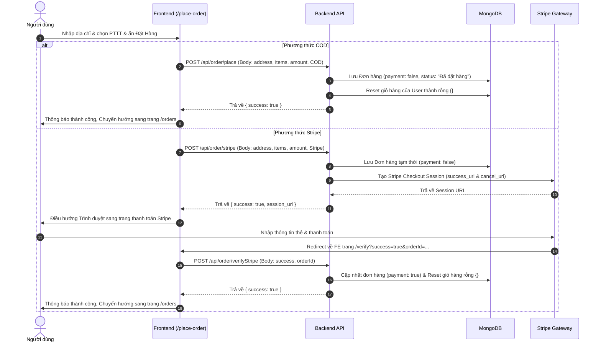

# 🗺️ Hướng Dẫn Luồng Hoạt Động & Kết Nối Frontend - Backend (Xuân Hải E-Commerce)

Tài liệu này mô tả chi tiết luồng hoạt động (Data Flow) và cách kết nối giữa **Frontend** (Trang người dùng & Trang quản trị) với **Backend** cho từng chức năng chính trong dự án.

---

## 🛠️ Tổng Quan Phương Thức Kết Nối

Dự án sử dụng mô hình **Client-Server** với các giao thức kết nối chính:
1. **HTTP Client (Axios)**: Frontend gửi các request (GET, POST) tới Backend API thông qua địa chỉ `VITE_BACKEND_URL` được cấu hình trong biến môi trường `.env`.
2. **Global State (`ShopContext`)**: [ShopContext.jsx](file:///g:/code/project/Clother_Shop/frontend/src/context/ShopContext.jsx) quản lý các trạng thái toàn cục như danh sách sản phẩm, trạng thái giỏ hàng (`cartItems`), và JWT token đăng nhập của người dùng.
3. **Xác thực Token (JWT)**: Token được lưu ở `localStorage` tại Frontend và gửi kèm trong HTTP Headers (`headers: { token }`) tới Backend ở mỗi request yêu cầu quyền hạn.
4. **Middlewares ở Backend**:
   - [auth.js](file:///g:/code/project/Clother_Shop/backend/middleware/auth.js): Giải mã JWT token của User và đính kèm `userId` vào `req.body`.
   - [adminAuth.js](file:///g:/code/project/Clother_Shop/backend/middleware/adminAuth.js): Xác thực quyền Admin bằng cách so sánh token giải mã được với thông tin đăng nhập admin.
   - [multer.js](file:///g:/code/project/Clother_Shop/backend/middleware/multer.js): Xử lý tải ảnh sản phẩm lên máy chủ tạm trước khi đẩy lên Cloudinary.

---

## 🔄 Chi Tiết Luồng Hoạt Động Của Từng Chức Năng

### 1. Chức năng Đăng ký & Đăng nhập (Authentication)

#### A. Đăng ký tài khoản (User Register)
* **Frontend**:
  - Giao diện: [Login.jsx](file:///g:/code/project/Clother_Shop/frontend/src/pages/Login.jsx) (Trạng thái `currentState === "Đăng ký"`).
  - Thu thập thông tin `name`, `email`, `password`.
  - Gửi request `POST` tới `/api/user/register`.
* **Backend**:
  - Nhận yêu cầu tại route `/register` trong [userRoute.js](file:///g:/code/project/Clother_Shop/backend/routes/userRoute.js).
  - Xử lý tại hàm `registerUser` trong [userController.js](file:///g:/code/project/Clother_Shop/backend/controllers/userController.js):
    1. Kiểm tra email hợp lệ qua thư viện `validator`.
    2. Kiểm tra độ dài mật khẩu (tối thiểu 8 ký tự).
    3. Mã hóa mật khẩu bằng `bcrypt.hash` (salt = 10).
    4. Lưu User mới vào MongoDB thông qua `userModel`.
    5. Tạo JWT token chứa `id` của user (`jwt.sign` với `JWT_SECRET`).
    6. Trả về phản hồi `{ success: true, token, user }`.
* **Frontend nhận phản hồi**:
  - Cập nhật state `token` trong `ShopContext` và lưu token vào `localStorage`.
  - Điều hướng người dùng về trang chủ (`/`) và hiển thị thông báo thành công.

#### B. Đăng nhập người dùng (User Login)
* **Frontend**:
  - Giao diện: [Login.jsx](file:///g:/code/project/Clother_Shop/frontend/src/pages/Login.jsx) (Trạng thái `currentState === "Đăng nhập"`).
  - Thu thập `email`, `password` và gửi request `POST` tới `/api/user/login`.
* **Backend**:
  - Xử lý tại hàm `loginUser` trong [userController.js](file:///g:/code/project/Clother_Shop/backend/controllers/userController.js):
    1. Tìm kiếm User theo email trong database.
    2. So sánh mật khẩu nhập vào với mật khẩu đã mã hóa trong DB bằng `bcrypt.compare`.
    3. Nếu khớp, tạo JWT token mới và trả về `{ success: true, token }`.
* **Frontend nhận phản hồi**:
  - Lưu token tương tự như luồng Đăng ký và chuyển hướng về trang chủ.

#### C. Đăng nhập trang quản trị (Admin Login)
* **Frontend Admin**:
  - Giao diện: [Login.jsx](file:///g:/code/project/Clother_Shop/admin/src/components/Login.jsx).
  - Thu thập `email`, `password` gửi `POST` tới `/api/user/admin`.
* **Backend**:
  - Xử lý tại hàm `adminLogin` trong [userController.js](file:///g:/code/project/Clother_Shop/backend/controllers/userController.js):
    1. So sánh trực tiếp email và mật khẩu với biến môi trường `ADMIN_EMAIL` và `ADMIN_PASSWORD`.
    2. Nếu đúng, tạo JWT token chứa chuỗi `ADMIN_EMAIL + ADMIN_PASSWORD` rồi trả về `{ success: true, token }`.
* **Frontend Admin nhận phản hồi**:
  - Lưu token trong state chính của ứng dụng Admin để hiển thị giao diện quản lý.

---

### 2. Chức năng Quản lý Sản phẩm (Product Management)

#### A. Lấy danh sách sản phẩm hiển thị (Fetch Products)
* **Frontend**:
  - Khi ứng dụng khởi chạy, `ShopContext.jsx` chạy hook `useEffect` gọi hàm `getProductsData()`.
  - Gửi request `GET` tới `/api/product/list`.
* **Backend**:
  - Route `/list` trong [productRoutes.js](file:///g:/code/project/Clother_Shop/backend/routes/productRoutes.js) trỏ đến `listProducts` trong [productController.js](file:///g:/code/project/Clother_Shop/backend/controllers/productController.js).
  - Lấy toàn bộ sản phẩm từ MongoDB thông qua `productModel.find({})`.
  - Trả về danh sách sản phẩm.
* **Frontend nhận phản hồi**:
  - Lưu danh sách vào state `products`. Từ đó, các trang như `Home`, `Collection`, `Product` sẽ lấy dữ liệu từ `products` để hiển thị, sắp xếp, lọc và tìm kiếm trực tiếp trên Client.

#### B. Thêm sản phẩm (Admin Add Product)
* **Frontend Admin**:
  - Giao diện: [Add.jsx](file:///g:/code/project/Clother_Shop/admin/src/pages/Add.jsx).
  - Sử dụng đối tượng `FormData` để đóng gói dữ liệu text và tối đa 4 tệp hình ảnh.
  - Gửi request `POST` tới `/api/product/add` kèm theo token quản trị trong Header.
* **Backend**:
  - Đi qua middleware `adminAuth` để xác thực quyền truy cập của Admin.
  - Đi qua middleware `upload.fields` (Multer) để nhận diện tối đa 4 file ảnh (`image1` -> `image4`).
  - Hàm `addProduct` xử lý:
    1. Upload các file ảnh tạm lên **Cloudinary** qua hàm `cloudinary.uploader.upload`.
    2. Lưu các URL ảnh nhận được từ Cloudinary vào mảng `imagesUrl`.
    3. Tạo dữ liệu sản phẩm đầy đủ (bao gồm mảng `imagesUrl` và các trường khác) và lưu vào cơ sở dữ liệu qua `productModel.save()`.
    4. Trả về kết quả thành công.

#### C. Xóa sản phẩm (Admin Remove Product)
* **Frontend Admin**:
  - Giao diện: [List.jsx](file:///g:/code/project/Clother_Shop/admin/src/pages/List.jsx).
  - Nhấp nút xóa gửi `POST` tới `/api/product/remove` với body `{ id: productId }` kèm token.
* **Backend**:
  - Hàm `removeProduct` nhận yêu cầu, thực thi xóa bản ghi sản phẩm bằng `productModel.findByIdAndDelete(id)`.
  - Trả về thông báo thành công. Frontend Admin sau đó gọi lại `fetchList()` để cập nhật giao diện.

---

### 3. Chức năng Giỏ hàng (Cart Management)

Giỏ hàng được quản lý đồng thời ở **Local State** (để tăng tốc độ phản hồi UI) và **MongoDB Database** (để đồng bộ khi chuyển đổi thiết bị).

#### A. Thêm sản phẩm vào giỏ (Add to Cart)
* **Frontend**:
  - Gọi hàm `addToCart(itemId, size)` trong [ShopContext.jsx](file:///g:/code/project/Clother_Shop/frontend/src/context/ShopContext.jsx).
  - Cập nhật state `cartItems` trên Client ngay lập tức.
  - Nếu đã đăng nhập (có `token`), gửi request `POST` tới `/api/cart/add` chứa `{ itemId, size }` với header `token`.
* **Backend**:
  - Đi qua middleware `authUser` để xác thực, giải mã token và lấy ra `userId` gắn vào `req.body.userId`.
  - Hàm `addToCart` trong [cartController.js](file:///g:/code/project/Clother_Shop/backend/controllers/cartController.js):
    1. Tìm thông tin giỏ hàng hiện tại của user trong database.
    2. Cập nhật số lượng của sản phẩm `itemId` ứng với kích cỡ `size` đó (nếu chưa có thì gán mặc định bằng 1, nếu có rồi tăng lên 1).
    3. Lưu lại giỏ hàng mới cập nhật bằng `userModel.findByIdAndUpdate`.
    4. Trả về trạng thái thành công.

#### B. Cập nhật số lượng sản phẩm trong giỏ hàng (Update Quantity)
* **Frontend**:
  - Người dùng thay đổi số lượng ở ô nhập liệu hoặc nhấn nút xóa (thùng rác) trong trang [Cart.jsx](file:///g:/code/project/Clother_Shop/frontend/src/pages/Cart.jsx).
  - Gọi hàm `updateQuantity(itemId, size, quantity)` trong `ShopContext.jsx`.
  - Nếu có `token`, gửi request `POST` tới `/api/cart/update` chứa `{ itemId, size, quantity }`.
* **Backend**:
  - Xử lý tại hàm `updateCart` trong [cartController.js](file:///g:/code/project/Clother_Shop/backend/controllers/cartController.js) (sau khi đi qua middleware `authUser`).
  - Ghi đè số lượng cũ bằng số lượng `quantity` mới đối với size và item tương ứng trong trường `cartData` của User, sau đó lưu vào DB.

#### C. Đồng bộ giỏ hàng khi đăng nhập
* **Frontend**:
  - Khi User đăng nhập thành công hoặc tải lại trang có sẵn token, ứng dụng gọi `getUserCart()` trong `ShopContext.jsx`.
  - Gửi request `POST` tới `/api/cart/get` kèm token.
* **Backend**:
  - Hàm `getUserCart` trong [cartController.js](file:///g:/code/project/Clother_Shop/backend/controllers/cartController.js) truy vấn thông tin User và trả về trường `cartData`.
  - Frontend nhận kết quả và cập nhật đè lên state `cartItems` trên trình duyệt.

---

### 4. Quy trình Đặt hàng & Thanh toán (Checkout & Payment Flow)

> [!NOTE]
> Để xem tài liệu chi tiết, sơ đồ tuần tự đầy đủ, cấu trúc database và hướng dẫn sửa lỗi cho luồng thanh toán, vui lòng đọc bản đầy đủ tại: **[README_PAYMENT_FLOW.md](file:///g:/code/project/Clother_Shop/README_PAYMENT_FLOW.md)**.

Luồng đặt hàng bắt đầu từ trang [PlaceOrder.jsx](file:///g:/code/project/Clother_Shop/frontend/src/pages/PlaceOrder.jsx), người dùng nhập địa chỉ giao hàng và chọn 1 trong 2 phương thức thanh toán: **COD** hoặc **Stripe**.



#### A. Thanh toán COD (Thanh toán khi nhận hàng)
1. **Frontend**: Gửi `POST` tới `/api/order/place` với body gồm thông tin địa chỉ (`address`), danh sách mặt hàng (`items`), tổng tiền (`amount`) và phương thức `paymentMethod: "COD"`.
2. **Backend**:
   - Hàm `placeOrder` trong [orderController.js](file:///g:/code/project/Clother_Shop/backend/controllers/orderController.js) lưu thông tin đơn hàng mới vào cơ sở dữ liệu qua `orderModel`.
   - Làm trống trường `cartData` của User trong MongoDB.
   - Trả về thông báo thành công.
3. **Frontend**: Làm trống local state `cartItems`, điều hướng sang trang lịch sử đơn hàng `/orders`.

#### B. Thanh toán qua Stripe
1. **Frontend**: Gửi `POST` tới `/api/order/stripe` với body chứa thông tin đơn hàng và phương thức `Stripe`.
2. **Backend**:
   - Hàm `placeOrderStripe` lưu đơn hàng tạm vào MongoDB (`payment: false`).
   - Xây dựng mảng sản phẩm `line_items` (bao gồm phí giao hàng) định dạng theo yêu cầu của Stripe API.
   - Khởi tạo cổng thanh toán bằng `stripe.checkout.sessions.create`:
     - Cấu hình URL trả về khi thành công (`success_url`): `${origin}/verify?success=true&orderId=${newOrder._id}`
     - Cấu hình URL trả về khi hủy (`cancel_url`): `${origin}/verify?success=false&orderId=${newOrder._id}`
   - Trả về URL thanh toán của Stripe (`session_url`).
3. **Frontend**: Thực hiện điều hướng trình duyệt của khách hàng tới trang cổng thanh toán Stripe bằng lệnh `window.location.replace(session_url)`.
4. **Xác minh thanh toán (Stripe Verification)**:
   - Khi thanh toán hoàn tất hoặc bị hủy, Stripe tự động đưa người dùng trở lại trang của Frontend: `/verify?success=true&orderId=...` hoặc `/verify?success=false&orderId=...`.
   - Component [Verify.jsx](file:///g:/code/project/Clother_Shop/frontend/src/pages/Verify.jsx) được mount, nó lấy các giá trị `success` và `orderId` từ URL.
   - Frontend gửi `POST` tới `/api/order/verifyStripe` kèm thông tin `{ success, orderId }` và token.
   - **Backend**: Hàm `verifyStripe` kiểm tra tham số:
     - Nếu `success === "true"`: Cập nhật trạng thái thanh toán đơn hàng thành `payment: true` và làm trống giỏ hàng của User trong database.
     - Nếu `success === "false"` (hoặc thất bại): Xóa bản ghi đơn hàng tạm thời vừa tạo ra khỏi database.
   - **Frontend**: Nếu xác minh thành công, làm trống local state `cartItems`, điều hướng sang `/orders` hiển thị thông báo thành công. Nếu thất bại, chuyển hướng người dùng quay lại giỏ hàng `/cart`.

---

### 5. Quản lý trạng thái Đơn hàng (Admin Order Management)

* **Xem tất cả đơn hàng**:
  - Giao diện Admin: [Order.jsx](file:///g:/code/project/Clother_Shop/admin/src/pages/Order.jsx).
  - Frontend Admin gửi `POST` tới `/api/order/list` kèm token quản trị.
  - Backend xử lý tại hàm `allOrders`, truy vấn tất cả hóa đơn trong DB bằng `orderModel.find({})` và gửi trả lại Frontend.
* **Cập nhật trạng thái vận chuyển**:
  - Admin thay đổi trạng thái thông qua thẻ `<select>` (Đã đặt hàng -> Đang đóng gói -> Đã gửi hàng -> Đang giao -> Đã giao).
  - Kích hoạt gửi request `POST` tới `/api/order/status` chứa `{ orderId, status }`.
  - Backend tại hàm `updateStatus` tìm đơn hàng và cập nhật trường `status` tương ứng. Gửi tín hiệu thành công về Frontend để tải lại dữ liệu mới nhất.

---

## ⚠️ Lưu Ý Quan Trọng Cho Lập Trình Viên

1. **Lỗi logic chính tả ở Frontend**:
   - Tại tệp [Cart.jsx](file:///g:/code/project/Clother_Shop/frontend/src/pages/Cart.jsx#L15), điều kiện kiểm tra độ dài mảng sản phẩm đang bị viết sai chính tả: `products.lenght === 0` (đúng ra phải là `length`). Điều này có thể khiến màn hình giỏ hàng hoạt động không như mong muốn nếu danh sách sản phẩm chưa tải kịp.
2. **Điểm cần lưu ý về đồng bộ tham số Route Verify Stripe**:
   - Ở Frontend [Verify.jsx](file:///g:/code/project/Clother_Shop/frontend/src/pages/Verify.jsx#L19-L30), request xác thực được gửi dưới dạng **POST body**: `{ success, orderId }`.
   - Tuy nhiên ở Backend [orderController.js](file:///g:/code/project/Clother_Shop/backend/controllers/orderController.js#L103), hàm `verifyStripe` lại trích xuất tham số từ **Query String** (`req.query`):
     ```javascript
     const { orderId, success, userId } = req.query;
     ```
     *Khuyến nghị:* Để route này hoạt động chính xác khi kết nối trực tiếp, bạn nên chỉnh sửa dòng code ở backend thành `const { orderId, success } = req.body;` (hoặc gửi kèm các tham số dưới dạng query ở URL từ phía Frontend).
3. **Cổng thanh toán Razorpay**:
   - Hiện tại chức năng này mới chỉ có định nghĩa route ở Backend nhưng hàm xử lý `placeOrderRazorpay` trong [orderController.js](file:///g:/code/project/Clother_Shop/backend/controllers/orderController.js#L126) đang để trống và chưa được triển khai hoàn thiện.
